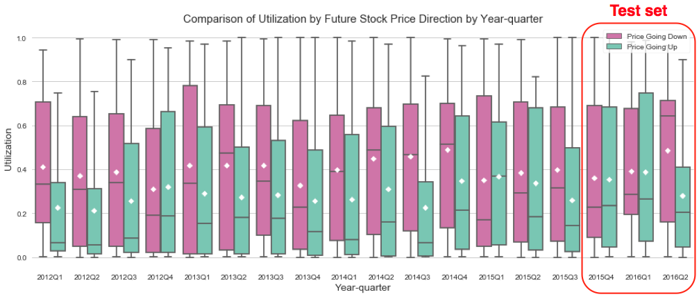

# Stock Price Drop Prediction with  Short Recommendations and Machine Learning Algorithms

## I. Background and Motivation

By reading stock recommendation articles written by analysts or experienced peer investors, investors expect to get an idea in which direction the stock price will move ahead of the market so they can make profit by buying or short selling the stocks. In the case of short recommendations, we want to know the stocks that will go down in the near future so that we can generate positive returns by shorting them.

Contrary to expectations (and somewhat disappointingly), the results in part 1 of my capstone project shows that overall short recommendations of Seeking Alpha (SA, hereafter) do not predict future stock returns on average. However, there exist some articles that correctly predict future price drop. **Are there any common features among those articles or the stocks covered in those articles? If so, can we utilize these features to make better prediction of stock price drop?**

This project tries to answer these questions by analyzing the articles of Seeking Alpha, one of the biggest investment-related social-media website in the US. I believe this project will shed light on which short recommendations add value to investors’ investment strategy.

## II. Data Preparation
The dataset from the capstone part 1 is used for the predictive modeling. For more details, please refer to the data preparation section of the capstone part 1.

## III. Data Description and Method
The goal is to predict whether the stock price will go up or down in 100 business days based on the attributes of short recommendation articles and the recommended stocks in the articles.

#### Features
* **y**: sign of 100-day holding period return (100d_ret)
> * y = 1 if 100d_ret < 0 (correct short recommendation)
> * y = 0 if 100d_ret >= 0 (wrong short recommendation)

* **X**: 30 attributes (28 numerical and 2 categorical) are selected based on the results of the capstone part 1 and finance literatures. For more details, please refer to the capstone part 1.
> * Market cap: firm size calculated as (stock price) x (share outstanding)
> * Utilization: shares sold short, as a percentage of shares available for lending
> * Word sentiment of the articles (LM dictionary)
> * Sentence sentiment of the articles (NLTK VADER)
> * Text physical properties and complexity of the articles
> * Top opinion leaders: popularity of authors
> * Disclosure of authors' short positions
> * Editors' pick

#### Data Time Period
* Training set: 2012Q1 - 2015Q3
* Test set: 2015Q4 - 2016Q2

#### Performance Measure of Prediction
* Precision: TP / (FP+TP)

#### Binary Classifiers
* Dummy Classifier (baseline model)
* Logistic Regression
* Random Forests
* Extra-Trees
* AdaBoost
* Gradient Boosting
* XGBoost
* SVC (Support Vector Classification)
* MLP (Multilayer Perceptron)

#### Method

1. For each model, perform "**time-series cross validation**" -> Calculate average and standard deviation of precisions from each validation -> Select best models.
>The goal of time series forecasting is to make accurate predictions about the future. The fast and powerful methods that we rely on in machine learning, such as using train-test splits and k-fold cross validation, do not work in the case of time series data. This is because they ignore the temporal components inherent in the problem. Therefore, time-series cross validation is used in this project.

2. **Fine-tune hyperparameters** of the selected models using GridSearchCV for better prediction -> Make predictions on the test set.

3. **Ensemble** the best models using hard/soft voting classifier -> Make predictions on the test set.

4. Compare the performance of predictions of the individual models and ensemble methods.

## IV. Results

#### Data Analysis
Let's take a look at how many articles made correct prediction of future price drop every quarters in sample period. Ratio of correct prediction to total number of short recommendations varies a lot with time. In order to deal with the class imbalance problem, precision is used as the performance measure.

Out of 30 attributes, both firm size and utilization clearly distinguish the short articles that predict the future price drop and the ones that don't.

All the other attributes such as the sentiment variables and the article characteristics didn't show any significant relationship with the future price direction. More details can be found in the notebooks.   

#### Predictive Modeling

Through time-series cross validation, logistic regression, gradient boosting, XGBoost and SVC are selected as the best individual models. Fine-tuning of hyperparameters are performed only for those selected models. Let's compare the performance of the selected individual models and ensemble models.

Hard voting classifier gives the best score (precision) on both the training set and the test set, 0.616 and 0.500 respectively. Compared to the performance of baseline dummy classifier (that predicts all recommendations as price drop), from 0.456 to 0.616 on the training set is a significant improvement. However, the change from 0.441 to 0.500 on the test set doesn't seem large.

Below is the feature importance plot of XGBoost model. As expected, firm size (mkt_cap) and utilization (util) are the most important features.

Why do the models perform significantly worse on the test set than on the training set? One possible reason we can think of is that the strong and consistent relationship between the explanatory variables and the response variable doesn't hold anymore during the time period of the test set. Let's check if this is the case.

* As shown in the graph, in 2016Q2, the firm size of the stocks with future price drop is larger than that of the stocks with future price increase on average for the first time.  
* During both 2015Q4 and 2016Q1, the average utilization of both groups are almost identical.

## V. Conclusion and Future Work

* One of the common problems dealing with time series prediction is the fact that data varies over time. In other words, there's no guarantee that the persistent relationship between variables will hold in the future.
* This is reason why the performance was significantly worse on the test set compared to the training set.
* In order to improve the performance of prediction, it is necessary to find better features.

